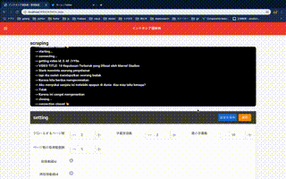

# docker+django+vue+nginx

## CONCEPT
インドネシア語学習サイトの管理画面です

## SETUP

```
cd frontend
npm install
```
env/.env.dev
を以下のようにする

```
DEBUG=1
SECRET_KEY=!0$5@7$m5n1-hz+p!vm30#@8cahlm2w4waa=p0o6q8s6=7u-v0
DJANGO_ALLOWED_HOSTS=localhost 127.0.0.1 [::1]
SQL_ENGINE=django.db.backends.postgresql
SQL_DATABASE=hello_django_dev
SQL_USER=hello_django
SQL_PASSWORD=hello_django
SQL_HOST=db
SQL_PORT=5432
DATABASE=postgres
DEVELOPER_KEY={グーグルデベロッパーキー}
```
DEVELOPER_KEY → [api key](https://developers.google.com/youtube/v3/getting-started)

### dev 

```
docker-compose -f docker-compose.yml up -d --build
``` 
app/backend/settings.pyでDEBUG_CELERY=Trueとすればceleryタスクをでバックできます。
http://localhost:8000/

#### ユーザー作成

```
docker-compose exec django python manage.py createsuperuser
```
### prod 
```
docker-compose -f docker-compose.prod.yml up -d --build
``` 


http://localhost:1337/ 

